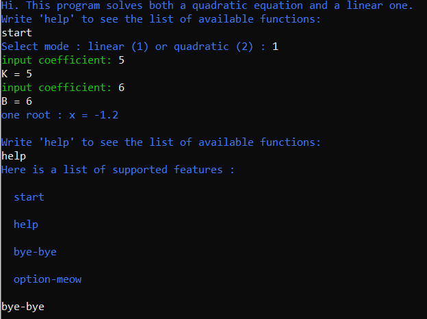
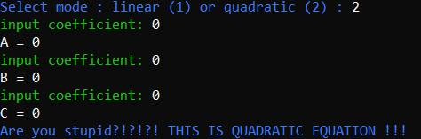
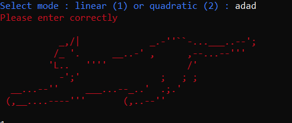
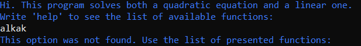
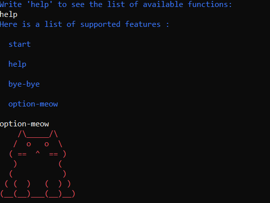
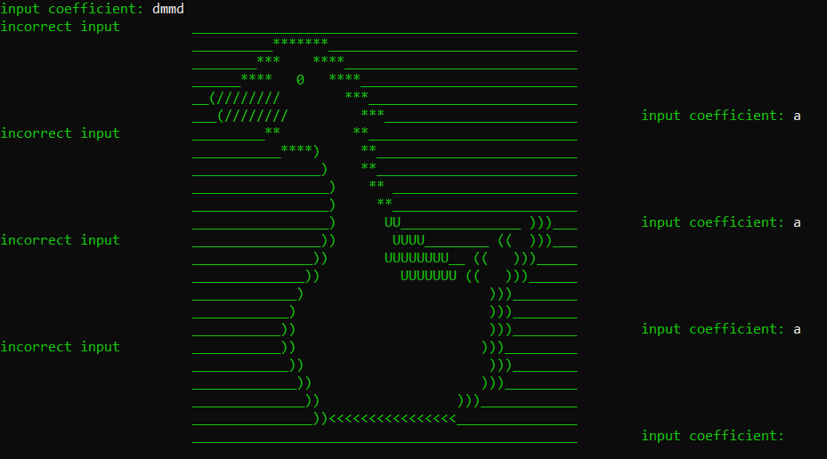
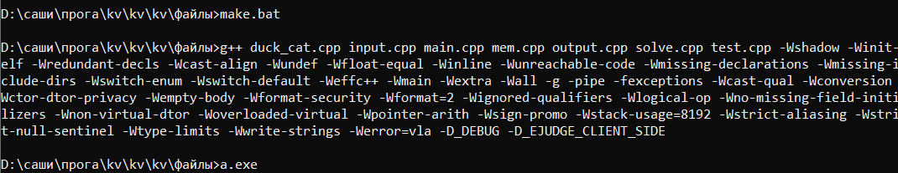

## Description

 This program is designed to solve equations. Quadratic and linear equations are supported.

# Options
## Help
 If you write 'help' at the very beginning or end, you will see a list of options supported by this program.
 * Help
 * Start
 * Bye-bye
 * Option-meow

## Start

 The 'start' option starts solving the equation. After 'start' you will be asked to choose which equation you want to solve. 

 To solve a **linear** equation, write *'linear'* or *'1'*. To solve a **quadratic** equation, write *'quadratic'* or *'2'*. 
 
 **Warning.**
 
 *ATTENTION! Do not try to enter the coefficient a = 0 in the quadratic equation solution mode. The program may swear!!!*
 
 
 
 After that, enter the coefficients of the equation (the program signs which coefficient you enter). 

 In case of incorrect input, you will get an error message, and in case of buffer overflow (which is also equal to incorrect input) you will see the corresponding message. 
 
  
  
  
 After completing the input, the program will output the number and value of roots or a message that there are an infinite number of roots or there are none at all.

 Note that in the process of solving the equation, you can select or enter only those options and values that the program currently offers you. Otherwise, you will see an error message.
 
  
 
 **Warning**
 
 *Note that the 'start' option can only be used once at the beginning of the program. 
After the root count is completed, this option cannot be used. At the end you can choose 'help', 'bye-bye', 'option-meow'.*

## Bye-bye

You can use the *'bye-bye'* option only before or after solving the equation. The *'bye-bye'* option ends the program. 

## Option-meow

The *'option-meow'* option outputs a pink cat :3.

 
 
## Warning

Do not be alarmed if you see cats or parts of a duck while using the program!!! IT WAS PLANNED THAT WAY!!!

 
 
 
 # Setup from sources:
 
 * Run git clone https://github.com/SashaOiya/kv/tree/main/файлы **--depth 1** (or clone your own fork of the repository)
 * Go into the cloned folder with *'cd kv'*
 * Run *'npm install'* (only has to be done before first start or when you change the source code)
 * Run *'npm start'*
 
 After downloading to the command line, you need to write 'make.bat' and after executing the command write 'a.exe '. 
Then follow the instructions in the program.

# Documentation

To open the documentation, go to the program folder and go to the HTML folder and run through doxygen *files.html*
